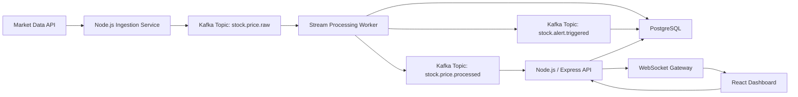

# Real-Time Stock Price Tracking Dashboard

## Project Status

This project is currently planned and in progress. The goal is to build a full-stack real-time stock tracking dashboard that ingests live market data, processes streaming price events, stores historical snapshots, and visualizes stock movement through an interactive web interface.

The project will focus on real-time backend engineering, event streaming, service-oriented architecture, database design, cloud deployment, and frontend data visualization.

## User Story

As a student developer interested in software engineering, cloud systems, and financial technology, I want to build a real-time stock price tracking application so I can understand how live data moves through a production-style system from ingestion to processing, storage, and visualization.

I want to do this project because many modern applications depend on fast, reliable data pipelines. A stock dashboard is a practical way to learn those skills because market data changes continuously, users expect low-latency updates, and the system needs to handle streaming events cleanly. This project will help me practice building software that is not just a static web app, but a real-time service that connects APIs, Kafka, WebSockets, PostgreSQL, Docker, GitHub Actions, and AWS.

The final application should help users monitor selected stocks, view live price changes, track basic indicators, and configure alerts for meaningful price movement.

## Problem Statement

Many beginner web applications fetch data only when a user refreshes the page. Real-world systems often need to ingest, process, and deliver data continuously. Stock market data is a strong use case because prices update frequently, users need timely feedback, and the backend must separate data ingestion from processing and real-time delivery.

This project aims to solve that by building a pipeline that:

- Ingests live stock price data from an external market data API.
- Publishes price updates as events through Kafka.
- Processes streaming events with backend consumers.
- Stores historical price snapshots in PostgreSQL.
- Sends low-latency updates to the frontend through WebSockets.
- Visualizes live and historical movement in a React dashboard.
- Supports user-defined watchlists and price alerts.

## Core Features To Build

### 1. Stock Watchlist

Users will be able to create a list of stock symbols they want to monitor.

Planned capabilities:

- Add stock symbols to a watchlist.
- Remove symbols from a watchlist.
- Validate supported ticker symbols.
- Display current price, daily change, and percentage movement.
- Persist watchlist data in PostgreSQL.

### 2. Live Market Data Ingestion

The backend will connect to a stock market data provider and ingest price updates.

Possible data providers:

- Finnhub
- Twelve Data
- Alpha Vantage
- Polygon.io
- Yahoo Finance-based data source for development experiments

Planned capabilities:

- Fetch or subscribe to price updates for tracked symbols.
- Normalize provider responses into a consistent internal event format.
- Handle rate limits and provider errors.
- Log ingestion failures for debugging.

### 3. Kafka Event Streaming

Kafka will be used to decouple data ingestion from processing and delivery.

Planned Kafka topics:

- `stock.price.raw` - raw normalized price events from the ingestion service
- `stock.price.processed` - processed price events with calculated metrics
- `stock.alert.triggered` - alert events generated from user-defined rules

Why Kafka is included:

- Separates ingestion, processing, storage, and delivery.
- Makes the system easier to scale.
- Provides a realistic event-driven architecture.
- Demonstrates stream processing fundamentals.

### 4. Stream Processing

A backend worker will consume Kafka events and calculate useful metrics.

Planned calculations:

- Latest price
- Price change
- Percentage change
- Simple moving average
- Short-term volatility signal
- High and low price within a recent window
- Alert condition checks

The first version will keep calculations simple and transparent so the system remains understandable and testable.

### 5. Real-Time WebSocket Updates

The backend will send processed price updates to connected frontend clients through WebSockets.

Planned capabilities:

- Subscribe clients to selected stock symbols.
- Push live price updates without page refreshes.
- Broadcast only relevant updates to each connected client.
- Handle reconnects and stale connections.
- Show connection state in the UI.

### 6. PostgreSQL Storage

PostgreSQL will be used to store users, watchlists, price snapshots, and alert rules.

Planned tables:

- `users` - optional user records if authentication is added
- `watchlists` - user watchlist metadata
- `watchlist_symbols` - tracked ticker symbols
- `price_snapshots` - historical price updates
- `alerts` - user-defined alert rules
- `alert_events` - triggered alert history

### 7. Real-Time Dashboard

The frontend will provide a clean dashboard for tracking live stock movement.

Planned screens:

- Main dashboard
- Watchlist management page
- Stock detail page
- Alert configuration page
- Historical price view

Planned dashboard details:

- Current price
- Daily movement
- Percent change
- Mini trend charts
- Live update status
- Alert indicators
- Historical chart view

### 8. Price Alerts

Users will be able to define basic alert conditions.

Planned alert types:

- Price rises above a target
- Price drops below a target
- Percentage movement exceeds a threshold
- Volatility signal is detected

The backend will evaluate alert rules during stream processing and store triggered alerts in PostgreSQL.

### 9. Backend API

The backend will be built with Node.js and Express.

Planned REST endpoints:

- `GET /api/stocks/search` - search or validate stock symbols
- `GET /api/watchlist` - get saved watchlist symbols
- `POST /api/watchlist` - add a symbol to the watchlist
- `DELETE /api/watchlist/:symbol` - remove a symbol from the watchlist
- `GET /api/stocks/:symbol/history` - get historical price snapshots
- `GET /api/alerts` - list alert rules
- `POST /api/alerts` - create an alert rule
- `DELETE /api/alerts/:id` - delete an alert rule
- `GET /api/alerts/events` - list triggered alert events

### 10. DevOps and Deployment

The project will include a deployment-ready workflow.

Planned DevOps work:

- Dockerize the frontend, backend, Kafka, and PostgreSQL services.
- Use Docker Compose for local development.
- Add GitHub Actions for linting, testing, and build verification.
- Deploy the application to AWS.
- Store API keys and secrets using environment variables.
- Document local setup and production deployment steps.

## Planned Architecture



## Tech Stack

### Frontend

- React
- TypeScript
- HTML
- CSS
- Charting library such as Recharts, Chart.js, or lightweight-charts

### Backend

- Node.js
- Express
- REST APIs
- WebSockets
- Kafka consumer and producer services

### Streaming and Data Processing

- Apache Kafka
- Kafka topics for raw prices, processed prices, and alerts
- Stream processing worker for metrics and alert checks

### Database

- PostgreSQL

### DevOps and Cloud

- Docker
- Docker Compose
- GitHub Actions
- AWS

## Data Flow

1. The ingestion service receives live price updates from a market data provider.
2. The service normalizes each update into a standard event format.
3. The normalized event is published to Kafka.
4. A stream processor consumes the event and calculates metrics.
5. Processed price snapshots are stored in PostgreSQL.
6. Alert rules are evaluated against the processed data.
7. Processed updates are pushed to connected clients through WebSockets.
8. The React dashboard updates charts and watchlist values in real time.

## Example Price Event

```json
{
  "symbol": "AAPL",
  "price": 192.43,
  "change": 1.27,
  "changePercent": 0.66,
  "volume": 5432100,
  "timestamp": "2026-05-26T18:30:00.000Z",
  "source": "market-data-provider"
}
```

## Example Alert Rule

```json
{
  "symbol": "MSFT",
  "condition": "PRICE_ABOVE",
  "targetPrice": 450.0,
  "enabled": true
}
```

## Development Roadmap

### Phase 1: Project Setup

- Create frontend and backend project structure.
- Configure TypeScript.
- Set up Express API server.
- Configure PostgreSQL connection.
- Add Docker Compose for local services.
- Add basic linting and formatting.

### Phase 2: Basic Dashboard

- Build the React dashboard layout.
- Add a watchlist UI.
- Add mock stock data for early frontend development.
- Render current price and percent change.
- Add basic chart components.

### Phase 3: Market Data Ingestion

- Choose a market data provider.
- Build the ingestion service.
- Normalize price responses into a shared event shape.
- Add error handling for rate limits and failed requests.
- Log ingestion activity.

### Phase 4: Kafka Pipeline

- Add Kafka to Docker Compose.
- Create raw and processed price topics.
- Publish normalized price events to Kafka.
- Build a consumer for processing events.
- Add retry and error handling behavior.

### Phase 5: Stream Processing

- Calculate moving averages.
- Calculate percent change.
- Track recent high and low values.
- Detect simple volatility signals.
- Store processed snapshots in PostgreSQL.

### Phase 6: WebSocket Delivery

- Add WebSocket support to the backend.
- Push processed price updates to connected clients.
- Subscribe clients to selected symbols.
- Add reconnect handling.
- Display connection status in the frontend.

### Phase 7: Alerts

- Build alert rule API endpoints.
- Add alert creation UI.
- Evaluate alert rules during stream processing.
- Store triggered alert events.
- Display alert history in the dashboard.

### Phase 8: Testing and Quality

- Add backend unit tests.
- Add API integration tests.
- Add tests for stream processing calculations.
- Add frontend component tests.
- Add test fixtures for sample price events.
- Add CI checks through GitHub Actions.

### Phase 9: Cloud Deployment

- Build production Docker images.
- Configure AWS deployment.
- Set environment variables for API keys and database credentials.
- Deploy frontend and backend services.
- Connect the backend to PostgreSQL.
- Document production setup and deployment commands.

## Success Criteria

The first complete version of the project should be able to:

- Track a user-defined list of stock symbols.
- Ingest live or near-real-time market data.
- Publish price events through Kafka.
- Process streaming events with backend workers.
- Store historical price snapshots in PostgreSQL.
- Push live price updates to the frontend with WebSockets.
- Visualize current and historical price movement in React.
- Trigger basic user-defined alerts.
- Run locally with Docker Compose.
- Pass automated checks in GitHub Actions.
- Be deployable to AWS.

## Possible Future Extensions

### User Authentication

Add user accounts so each user can manage their own watchlist and alerts.

### Portfolio Tracking

Allow users to enter share quantities and track portfolio value over time.

### Advanced Technical Indicators

Add more financial indicators such as:

- Exponential moving average
- RSI
- MACD
- Bollinger Bands
- Volume trend analysis

### Notification System

Send triggered alerts through:

- Email
- SMS
- Push notifications
- Slack or Discord webhooks

### Multiple Data Providers

Support provider failover so the application can switch to another data source if one provider is unavailable.

### Backtesting Mode

Replay historical market data through Kafka to test alert rules and stream-processing behavior.

### Analytics Dashboard

Add deeper analytics for price movement, alert frequency, and watchlist performance.

### AWS Managed Kafka

Explore Amazon MSK as a production-ready Kafka option.

### Infrastructure as Code

Use Terraform or AWS CDK to define cloud infrastructure.

### Mobile-Friendly Layout

Improve the dashboard for mobile screens so users can monitor watchlists from phones and tablets.

## Learning Goals

This project is designed to demonstrate practical experience with:

- Full-stack web development
- Real-time data visualization
- Node.js and Express backend services
- Kafka event streaming
- WebSocket communication
- REST API design
- PostgreSQL database design
- Stream processing concepts
- Docker-based local development
- CI/CD automation with GitHub Actions
- AWS deployment
- Service-oriented architecture
- Cloud and DevOps fundamentals

## Current Scope

The initial version will focus on a small number of stock symbols, simple technical indicators, and reliable real-time updates. The first goal is to make the data pipeline work end to end before expanding into advanced financial analytics or multi-user portfolio features.

This project is intended for software engineering learning and portfolio demonstration. It is not financial advice and should not be used for trading decisions.
